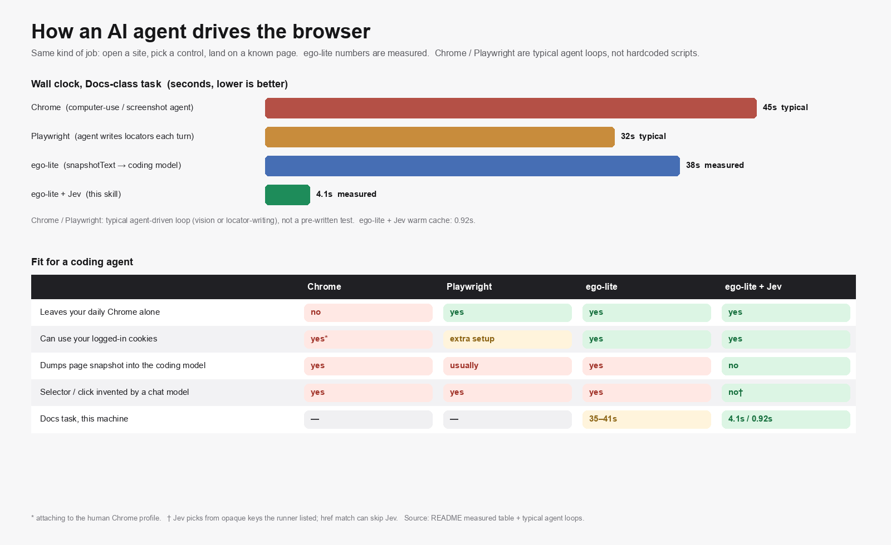

# egolite-jev

[English](README.md) · [中文](README.zh-CN.md)

[](LICENSE)
[](https://lite.ego.app/)
[](https://openrouter.ai/keys)

A companion skill for [ego lite](https://lite.ego.app/). The coding agent states a **goal** and a **success check**. This runner lists on-page controls, clicks inside one `ego-browser` process, and returns JSON. Success is a URL or title match — not a model saying it is done.

It does not dump `snapshotText()` into the coding model between clicks.

---

### Install (Claude Code & Codex)

```bash
curl -fsSL https://raw.githubusercontent.com/raydocs/egolite-jev/main/scripts/install.sh | bash
```

The script links the skill into `~/.claude/skills` and `~/.codex/skills`, then asks for an [OpenRouter](https://openrouter.ai/keys) key (`sk-or-…`). The key is stored at `~/.config/egolite-jev/env` (mode 600). `scripts/run` reads it; you do not export it every session.

```bash
npx skills add raydocs/egolite-jev
```

Requires `ego-browser` on `PATH`.

### Give this to the agent

```
Read the egolite-jev skill. Do not dump snapshotText() into chat.
Run:
GOAL='Open the Docs page' URL='https://lite.ego.app/' SUCCESS_MATCH='/document' \
  ~/.claude/skills/egolite-jev/scripts/run
```

Codex: use `~/.codex/skills/egolite-jev/scripts/run`.  
Pass only if `ok: true` and `page.url` contains `/document`. Print `elapsed_ms` and `steps[].via`.

---

## Why this exists

| | Chrome computer-use | Playwright (agent-written) | ego-lite snapshot → LLM | **ego-lite + Jev** |
|---|---|---|---|---|
| Leaves your daily Chrome alone | no | yes | yes | **yes** |
| Logged-in cookies | yes* | extra setup | yes | **yes** |
| Page dump into the coding model | yes | usually | yes | **no** |
| Docs task (this machine) | — | — | 35–41 s | **4.1 s / 0.92 s** |

\* attaching to the human Chrome profile.



Chrome and Playwright bars are **typical agent loops** (screenshots, or the model writing locators each turn), not a pre-written test. ego-lite figures are **measured** here for `Open the Docs page` on [lite.ego.app](https://lite.ego.app/).

If the top control’s `href` already contains `SUCCESS_MATCH`, Jev is skipped (`via: "href"`).

---

## How it works

```
GOAL + SUCCESS_MATCH
        │
        ▼
  snapshot (local)  →  ranked controls with opaque keys (click_1, …)
        │
        ├─ href already matches SUCCESS_MATCH  →  click
        └─ otherwise  →  Jev Choice  →  validate  →  click
        │
        ▼
  ok: true  only if the live URL/title contains SUCCESS_MATCH
```

Jev never sees `@ref`. Fill text comes only from `JEV_FILL`. Default cap: 4 actions.

---

## Usage

```bash
GOAL='Open the Docs page' \
  URL='https://lite.ego.app/' \
  SUCCESS_MATCH='/document' \
  ./scripts/run
```

| Variable | Required | |
|---|---|---|
| `GOAL` | yes | What success looks like |
| `SUCCESS_MATCH` | yes | Substring of URL or title |
| `URL` | | Start tab |
| `JEV_FILL` | | JSON map of values to type |
| `MAX_STEPS` | | Default 4, max 8 |
| `SPACE` | | ego task space name |

```json
{
  "ok": true,
  "reason": "done",
  "elapsed_ms": 4131,
  "page": {
    "url": "https://lite.ego.app/document/en/docs/quick-start"
  },
  "steps": [
    { "via": "href", "acted": "click", "detail": "CLICK anchor \"Docs\" → …/quick-start" }
  ]
}
```

| `reason` | |
|---|---|
| `done` | Stop. Extract with `js()` if needed. |
| `need_llm` | One targeted snapshot, then a heredoc or stop. |
| `dialog` | Hand off to the user. |
| `budget_exhausted` | Do not rerun unchanged. |

`ok` is true only for `done`.

---

## Tests

```bash
node --test tests
```

## License

[MIT](LICENSE). Browser: [ego lite](https://lite.ego.app/). Decisions: [TypeSafe Jev](https://docs.typesafe.ai) via OpenRouter.
